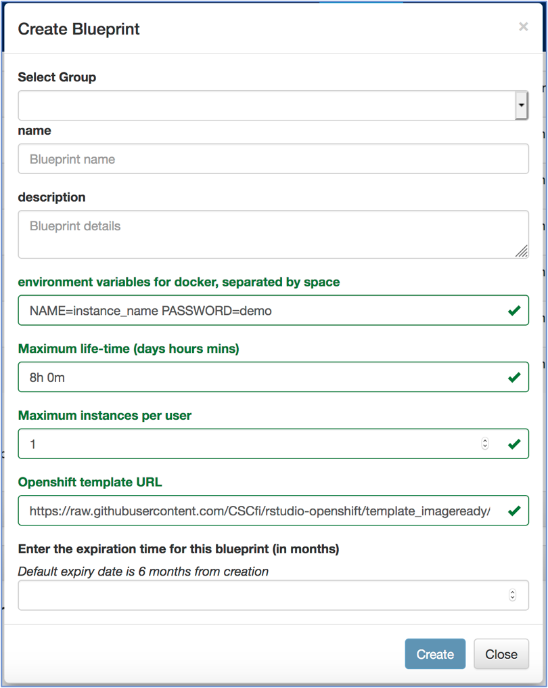

# rstudio-openshift applications (Work in progress)

Rstudio-openshift applications facilitate running containerised data analytics tools of Rstudio in CSC's [Rahti container cloud](https://rahti.csc.fi/) and [notebooks environment](https://notebooks.csc.fi/). This repository contains openshift templates borrowed from other [CSC Github repository](https://github.com/CSCfi/rstudio-openshift). Rstudio custom images, which are built using docker environment, can be tailored depending on the requirements.

Contaienrised Rstudio images currently include:
- [rstudio for DAKI project](#rstudio-for-DAKI-project)
- [rstudio for training environment](#rstudio-for-training-environment) 

Once rstudio image is compatible for deploying in openshift environment, you can then deploy in notebooks environment. Please follow instructions for [deploying rstudio images onto notebooks environment](#Deployment-of-rstudio-images-onto-notebooks-environment)

# rstudio for DAKI project

Rstudio docker container for DAKI project (rstudio-daki) includes the latest version of R (v4.0.0), rstudio and required R-packages to help with various data analysis activities in the broad scope of DAKI project. Customised Dockerfile (file name: Dockerfile) which is meant for deploying on Rahti and eventually on notebooks is available in *daki-shiny* folder. 

In addition, "*.dockerfile" is also included to generate a docker image that can be deployed on cPouta environment where users usually have previlized access rights. The image thus generated however may not be compatible either in openshift or notebooks enviroment.

### Deploying rstudio-daki on Rahti *via* commandline
Original openshift template (i.e., *rstudio-template.yaml*) was renamed as *rstudio-daki-shiny-template.yaml* to deploy rstudio-daki on Rahti container cloud. 

Please use the following openshift command to deploy rstudio-daki server on Rahti:

* *oc process -f rstudio-daki-shiny-template.yaml -p NAME="application-name" -p USERNAME="your-username" -p PASSWORD="your-password" | oc apply -f -*

# rstudio for training environment 
Rstudio dockerfile for basic data analyis course (rstudio-rda) includes the latest version of rstudio, R (v4.0.2) and basic R-packages. Dockerfile (*rstudio-rda.dockerfile*) for building the custom image is available in *rda* folder.

## Deploying rstudio-rda on Rahti *via* commandline
Please use  *rstudio-rda-template.yaml* template which will use *Dockerfile* available in *rda* folder for deployment on Rahti.

The following openshift command can be used to deploy rstudio-rda server on Rahti

* *oc process -f rstudio-rda-shiny-template.yaml -p NAME="application-name" -p USERNAME="your-username" -p PASSWORD="your-password" | oc apply -f -*

# Deployment of rstudio images onto notebooks environment

## Funding

